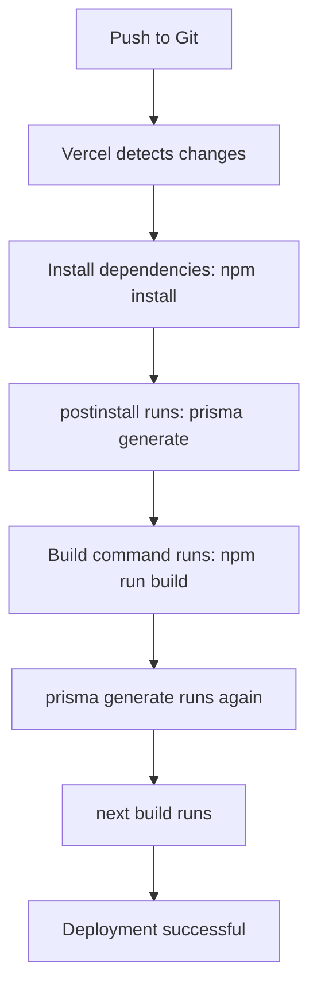

# Vercel Deployment Guide

## Overview

This document explains how the application is configured for deployment on Vercel, with special attention to Prisma Client generation and custom output paths.

---

## 🔧 Prisma Configuration

### Custom Output Path

The Prisma Client is generated to a **custom location** instead of the default `node_modules/@prisma/client`:

```prisma
// prisma/schema.prisma
generator client {
  provider = "prisma-client-js"
  output   = "../lib/generated/prisma"
}
```

**Why?** This allows better control over the generated client location and keeps it within the project structure.

---

## 🚀 Build Configuration

### Package.json Scripts

The `package.json` has been configured with two critical scripts to ensure Prisma Client generation on Vercel:

```json
{
  "scripts": {
    "build": "prisma generate && next build",
    "postinstall": "prisma generate"
  }
}
```

#### **1. `build` Script**
```bash
prisma generate && next build
```
- **Purpose**: Ensures Prisma Client is generated before Next.js build
- **When it runs**: During Vercel's build phase
- **Why it's needed**: Vercel caches dependencies, so we must regenerate the client on each build

#### **2. `postinstall` Script**
```bash
prisma generate
```
- **Purpose**: Automatically generates Prisma Client after `npm install`
- **When it runs**: After dependencies are installed (both locally and on Vercel)
- **Why it's needed**: Ensures the client is always available after fresh installs

---

## 📁 .gitignore Configuration

The generated Prisma Client is **ignored in git**:

```gitignore
# Prisma generated client (regenerated on build via postinstall script)
/lib/generated/prisma
```

**Why?**
- ✅ Reduces repository size
- ✅ Prevents merge conflicts on generated code
- ✅ Forces fresh generation on each deployment
- ✅ Ensures the client matches the exact Prisma version installed

---

## 🔄 Deployment Flow on Vercel

Here's what happens when you deploy to Vercel:



### Step-by-Step Process

1. **Git Push**: You push code to your repository
2. **Vercel Trigger**: Vercel detects the push and starts deployment
3. **Install Dependencies**: `npm install` runs
4. **Postinstall Hook**: `prisma generate` runs automatically
5. **Build Command**: `npm run build` executes
6. **Prisma Generate**: Runs again (ensures latest schema)
7. **Next.js Build**: Application builds with fresh Prisma Client
8. **Deploy**: Application is deployed to Vercel

---

## ⚠️ Common Issues & Solutions

### Issue 1: "Prisma Client is outdated"

**Error Message:**
```
Error [PrismaClientInitializationError]: Prisma has detected that this project 
was built on Vercel, which caches dependencies. This leads to an outdated Prisma 
Client because Prisma's auto-generation isn't triggered.
```

**Solution:** ✅ Already fixed!
- The `build` script now includes `prisma generate`
- The `postinstall` script ensures generation after dependency installation

---

### Issue 2: "Cannot find module '@/lib/generated/prisma'"

**Cause:** Prisma Client not generated before build

**Solution:** ✅ Already fixed!
- The `postinstall` and `build` scripts ensure generation
- All imports use the correct path: `@/lib/generated/prisma`

---

### Issue 3: Database Connection Timeout During Build

**Error Message:**
```
Timed out fetching a new connection from the connection pool
```

**Solution:** ✅ Already fixed!
- Pages that fetch data are marked with `export const dynamic = 'force-dynamic'`
- This prevents static generation at build time
- Data is fetched at runtime instead

**Files with dynamic rendering:**
- `app/projects/page.tsx`
- `app/projects/[slug]/page.tsx`

---

## 🌍 Environment Variables

Ensure these environment variables are set in Vercel:

### Required Variables

```bash
# Database Connection (Supabase)
DATABASE_URL=postgresql://...       # Connection pooling URL
DIRECT_URL=postgresql://...         # Direct connection URL

# Strapi CMS
STRAPI_URL=http://your-strapi-url   # Strapi base URL
STRAPI_TOKEN=your-api-token         # Strapi API token
```

### Setting Environment Variables in Vercel

1. Go to your project in Vercel Dashboard
2. Navigate to **Settings** → **Environment Variables**
3. Add each variable with appropriate values
4. Select environments: **Production**, **Preview**, **Development**
5. Click **Save**

---

## 🧪 Testing the Build Locally

Before deploying to Vercel, test the build process locally:

```bash
# Clean previous builds
rm -rf .next
rm -rf lib/generated/prisma

# Install dependencies (triggers postinstall)
npm install

# Verify Prisma Client was generated
ls lib/generated/prisma/

# Run production build
npm run build

# Start production server
npm run start
```

**Expected Output:**
```
✔ Generated Prisma Client (v6.15.0) to .\lib\generated\prisma
✓ Compiled successfully
✓ Linting and checking validity of types
✓ Collecting page data
✓ Generating static pages
✓ Finalizing page optimization
```

---

## 📊 Build Output Analysis

After a successful build, you should see:

```
Route (app)                              Size  First Load JS
┌ ○ /                                 4.54 kB         152 kB
├ ƒ /api/leads                          150 B        99.8 kB
├ ƒ /api/projects                       150 B        99.8 kB
├ ƒ /projects                           165 B         103 kB
└ ƒ /projects/[slug]                    165 B         103 kB

○  (Static)   prerendered as static content
ƒ  (Dynamic)  server-rendered on demand
```

**Legend:**
- `○` = Static pages (pre-rendered at build time)
- `ƒ` = Dynamic pages (rendered on-demand at runtime)

---

## 🔍 Verifying Deployment

After deploying to Vercel, verify everything works:

### 1. Check Build Logs

In Vercel Dashboard → Deployments → [Your Deployment] → Build Logs

Look for:
```
✔ Generated Prisma Client (v6.15.0) to ./lib/generated/prisma
```

### 2. Test API Endpoints

```bash
# Test health endpoint
curl https://your-app.vercel.app/api/health

# Test projects API
curl https://your-app.vercel.app/api/projects

# Test leads API
curl https://your-app.vercel.app/api/leads
```

### 3. Check Runtime Logs

In Vercel Dashboard → Deployments → [Your Deployment] → Runtime Logs

Look for any Prisma-related errors.

---

## 🎯 Best Practices

### ✅ Do's

- ✅ Always run `prisma generate` in the build script
- ✅ Use `postinstall` hook for automatic generation
- ✅ Keep generated client in `.gitignore`
- ✅ Use environment variables for database URLs
- ✅ Test builds locally before deploying
- ✅ Use `force-dynamic` for pages that fetch data

### ❌ Don'ts

- ❌ Don't commit generated Prisma Client to git
- ❌ Don't use default Prisma output path if you need custom location
- ❌ Don't skip `prisma generate` in build scripts
- ❌ Don't hardcode database credentials
- ❌ Don't pre-render pages that require database connections at build time

---

## 🔗 Additional Resources

- [Vercel Deployment Documentation](https://vercel.com/docs)
- [Prisma Deployment Guide](https://www.prisma.io/docs/guides/deployment/deployment-guides/deploying-to-vercel)
- [Next.js Deployment](https://nextjs.org/docs/deployment)
- [Supabase with Prisma](https://supabase.com/docs/guides/integrations/prisma)

---

## 📝 Summary

**Problem:** Vercel caches dependencies, causing outdated Prisma Client errors

**Solution:**
1. ✅ Added `prisma generate` to `build` script
2. ✅ Added `postinstall` script for automatic generation
3. ✅ Kept generated client in `.gitignore`
4. ✅ Configured dynamic rendering for data-fetching pages

**Result:** 🎉 Successful deployments with fresh Prisma Client on every build!

