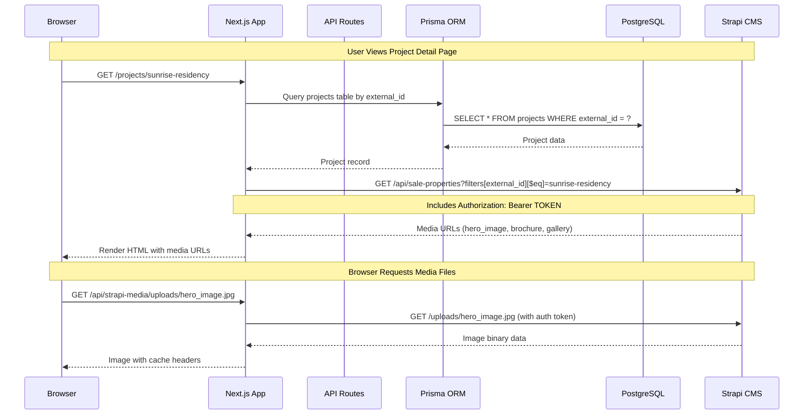
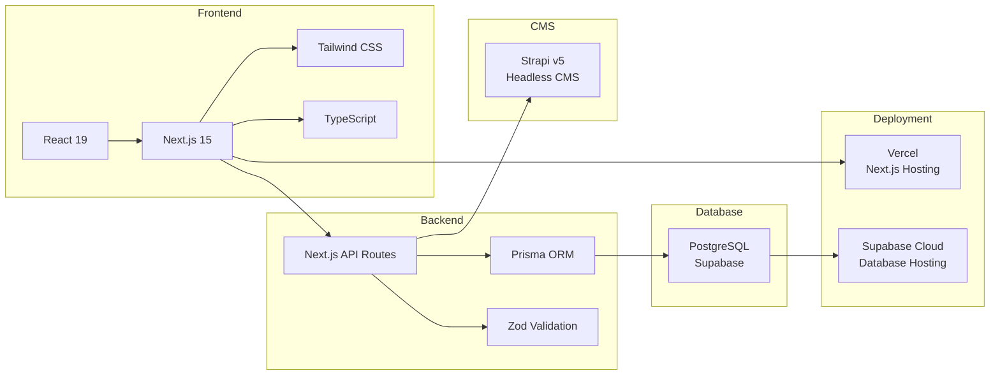
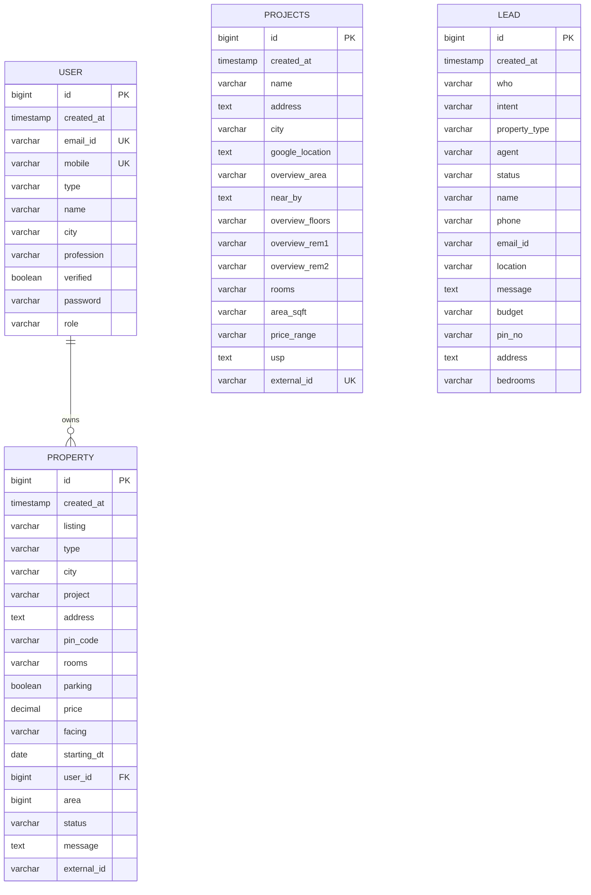
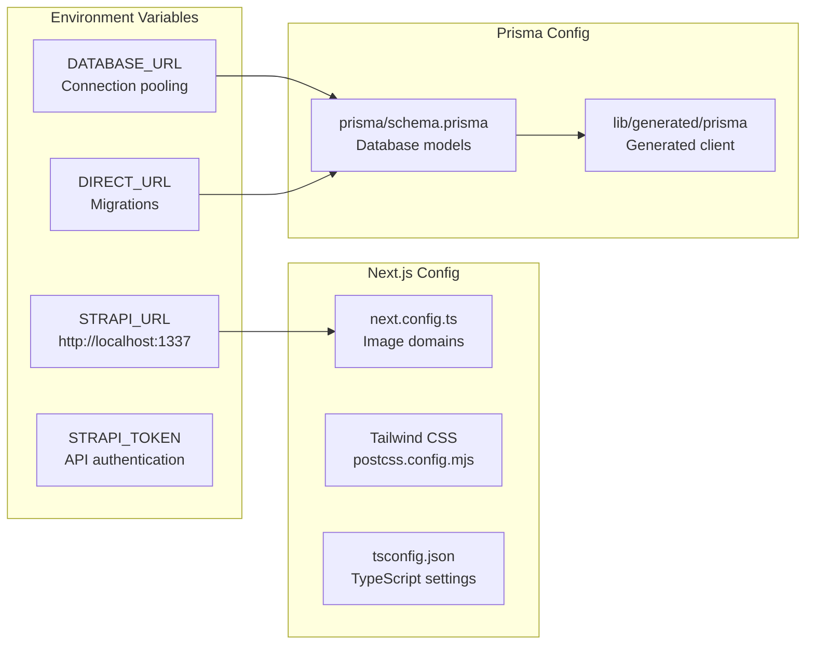
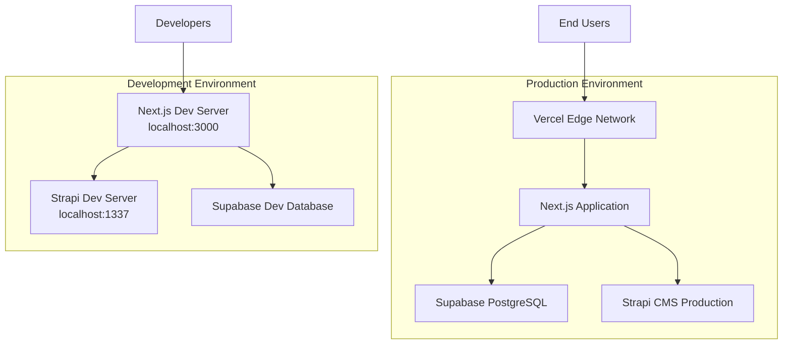

# Web Application Architecture

## Overview
This document describes the architecture of the Real Estate Agency Web Application built with Next.js 15, Prisma ORM, PostgreSQL (Supabase), and Strapi CMS.

## System Architecture Diagram

```mermaid
graph TB
    subgraph "Client Layer"
        Browser[Web Browser]
        Mobile[Mobile Browser]
    end

    subgraph "Next.js Application - Port 3000"
        subgraph "Frontend Pages"
            HomePage[Home Page /]
            BuyPage[Buy Page /buy]
            RentPage[Rent Page /rent]
            ProjectsPage[Projects List /projects]
            ProjectDetailPage[Project Detail /projects/slug]
            LoginPage[Login /login]
            RegisterPage[Register /register]
            ContactPage[Contact /contact-us]
            EnqueryPage[Enquiry /enquery]
            PostingPage[Posting /posting]
        end

        subgraph "React Components"
            Header[Header]
            Footer[Footer]
            SearchBar[SearchBar]
            PropertyCard[PropertyCard]
            WhatsAppChat[WhatsApp Chat Widget]
        end

        subgraph "API Routes"
            subgraph "REST API Endpoints"
                UsersAPI[/api/users<br>/api/users/id]
                PropertiesAPI[/api/properties<br>/api/properties/id]
                ProjectsAPI[/api/projects<br>/api/projects/id]
                LeadsAPI[/api/leads<br>/api/leads/id]
                StrapiMediaProxy[/api/strapi-media/...]
            end
        end

        subgraph "Business Logic Layer"
            PrismaClient[Prisma Client]
            StrapiClient[Strapi Client lib/strapi.ts]
            Validation[Validation Layer<br>lib/validation/]
            Utils[Utilities<br>lib/utils/]
            Types[TypeScript Types<br>lib/types/]
        end
    end

    subgraph "External Services"
        subgraph "Strapi CMS - Port 1337"
            StrapiAPI[Strapi REST API<br>/api/sale-properties]
            StrapiMedia[Media Library<br>/uploads/...]
            StrapiDB[(Strapi Database)]
        end

        subgraph "Supabase PostgreSQL"
            Database[(PostgreSQL Database)]
            subgraph "Database Tables"
                UserTable[user]
                PropertyTable[property]
                ProjectsTable[projects]
                LeadTable[Lead]
            end
        end
    end

    %% Client to Frontend
    Browser --> HomePage
    Browser --> BuyPage
    Browser --> RentPage
    Browser --> ProjectsPage
    Browser --> ProjectDetailPage
    Browser --> LoginPage
    Browser --> RegisterPage
    Browser --> ContactPage
    Browser --> EnqueryPage
    Browser --> PostingPage
    Mobile --> HomePage

    %% Frontend to Components
    HomePage --> Header
    HomePage --> Footer
    HomePage --> SearchBar
    HomePage --> PropertyCard
    HomePage --> WhatsAppChat

    %% Frontend to API
    HomePage --> PropertiesAPI
    BuyPage --> PropertiesAPI
    RentPage --> PropertiesAPI
    ProjectsPage --> ProjectsAPI
    ProjectDetailPage --> ProjectsAPI
    ProjectDetailPage --> StrapiMediaProxy
    LoginPage --> UsersAPI
    RegisterPage --> UsersAPI
    ContactPage --> LeadsAPI
    EnqueryPage --> LeadsAPI

    %% API to Business Logic
    UsersAPI --> Validation
    UsersAPI --> PrismaClient
    UsersAPI --> Utils
    PropertiesAPI --> Validation
    PropertiesAPI --> PrismaClient
    PropertiesAPI --> Utils
    ProjectsAPI --> Validation
    ProjectsAPI --> PrismaClient
    ProjectsAPI --> StrapiClient
    ProjectsAPI --> Utils
    LeadsAPI --> Validation
    LeadsAPI --> PrismaClient
    LeadsAPI --> Utils
    StrapiMediaProxy --> StrapiClient

    %% Business Logic to Database
    PrismaClient --> Database
    Database --> UserTable
    Database --> PropertyTable
    Database --> ProjectsTable
    Database --> LeadTable

    %% Strapi Integration
    StrapiClient --> StrapiAPI
    StrapiAPI --> StrapiDB
    StrapiAPI --> StrapiMedia
    StrapiMediaProxy --> StrapiMedia

    %% Styling
    classDef frontend fill:#61dafb,stroke:#333,stroke-width:2px,color:#000
    classDef api fill:#68a063,stroke:#333,stroke-width:2px,color:#fff
    classDef database fill:#336791,stroke:#333,stroke-width:2px,color:#fff
    classDef external fill:#ff6b6b,stroke:#333,stroke-width:2px,color:#fff
    classDef logic fill:#f39c12,stroke:#333,stroke-width:2px,color:#000

    class HomePage,BuyPage,RentPage,ProjectsPage,ProjectDetailPage,LoginPage,RegisterPage,ContactPage,EnqueryPage,PostingPage,Header,Footer,SearchBar,PropertyCard,WhatsAppChat frontend
    class UsersAPI,PropertiesAPI,ProjectsAPI,LeadsAPI,StrapiMediaProxy api
    class Database,UserTable,PropertyTable,ProjectsTable,LeadTable,StrapiDB database
    class StrapiAPI,StrapiMedia external
    class PrismaClient,StrapiClient,Validation,Utils,Types logic
```

## Data Flow Diagram



## Technology Stack



## API Architecture

```mermaid
graph TB
    subgraph "API Layer Structure"
        subgraph "Users API"
            GetUsers[GET /api/users<br>List with filters & pagination]
            GetUser[GET /api/users/id<br>Get single user]
            CreateUser[POST /api/users<br>Create new user]
            UpdateUser[PUT /api/users/id<br>Update user]
            DeleteUser[DELETE /api/users/id<br>Delete user]
        end

        subgraph "Properties API"
            GetProperties[GET /api/properties<br>List with filters]
            GetProperty[GET /api/properties/id<br>Get single property]
            CreateProperty[POST /api/properties<br>Create property]
            UpdateProperty[PUT /api/properties/id<br>Update property]
            DeleteProperty[DELETE /api/properties/id<br>Delete property]
        end

        subgraph "Projects API"
            GetProjects[GET /api/projects<br>List with filters]
            GetProject[GET /api/projects/id<br>Get single project]
            CreateProject[POST /api/projects<br>Create project]
            UpdateProject[PUT /api/projects/id<br>Update project]
            DeleteProject[DELETE /api/projects/id<br>Delete project]
        end

        subgraph "Leads API"
            GetLeads[GET /api/leads<br>List with filters]
            GetLead[GET /api/leads/id<br>Get single lead]
            CreateLead[POST /api/leads<br>Create lead]
            UpdateLead[PUT /api/leads/id<br>Update lead]
            DeleteLead[DELETE /api/leads/id<br>Delete lead]
        end

        subgraph "Media Proxy API"
            ProxyMedia[GET /api/strapi-media/...<br>Proxy Strapi media with auth]
        end
    end

    subgraph "Shared Utilities"
        ErrorHandler[Error Handler<br>lib/utils/error-handler.ts]
        Validators[Validators<br>lib/validation/]
        Formatters[Response Formatters<br>lib/utils/]
    end

    GetUsers --> ErrorHandler
    GetUsers --> Validators
    GetUsers --> Formatters
    
    GetProperties --> ErrorHandler
    GetProperties --> Validators
    
    GetProjects --> ErrorHandler
    GetProjects --> Validators
    
    GetLeads --> ErrorHandler
    GetLeads --> Validators
    
    ProxyMedia --> ErrorHandler
```



## Database Schema



## Environment Configuration



## Key Features

### 1. **Server-Side Rendering (SSR)**
- Project detail pages are server-rendered for SEO
- Dynamic routes with `[slug]` parameter
- Async data fetching with Prisma

### 2. **API Proxy Pattern**
- `/api/strapi-media/...` proxies private Strapi uploads
- Server-side authentication with Bearer token
- Client-side URLs remain clean and cacheable

### 3. **Type Safety**
- Full TypeScript coverage
- Prisma-generated types
- Custom type definitions in `lib/types/`

### 4. **Error Handling**
- Centralized error handler
- Prisma error mapping
- Consistent API response format

### 5. **Validation**
- Request validation with custom validators
- Type-safe validation functions
- Detailed error messages

### 6. **Database Connection**
- Connection pooling with Prisma
- Supabase PostgreSQL backend
- Row-level security support

## Security Considerations

1. **Authentication**: Strapi media requires Bearer token authentication
2. **Proxy Pattern**: Media files proxied through Next.js to hide credentials
3. **Environment Variables**: Sensitive data in `.env` file (not committed)
4. **Input Validation**: All API inputs validated before database operations
5. **SQL Injection Prevention**: Prisma ORM parameterized queries

## Performance Optimizations

1. **Caching**: Media files cached with `max-age=31536000, immutable`
2. **Connection Pooling**: Prisma connection pooling for database
3. **Image Optimization**: Next.js Image component for optimized images
4. **Code Splitting**: Automatic code splitting with Next.js
5. **Turbopack**: Fast development builds with Turbopack

## Deployment Architecture



