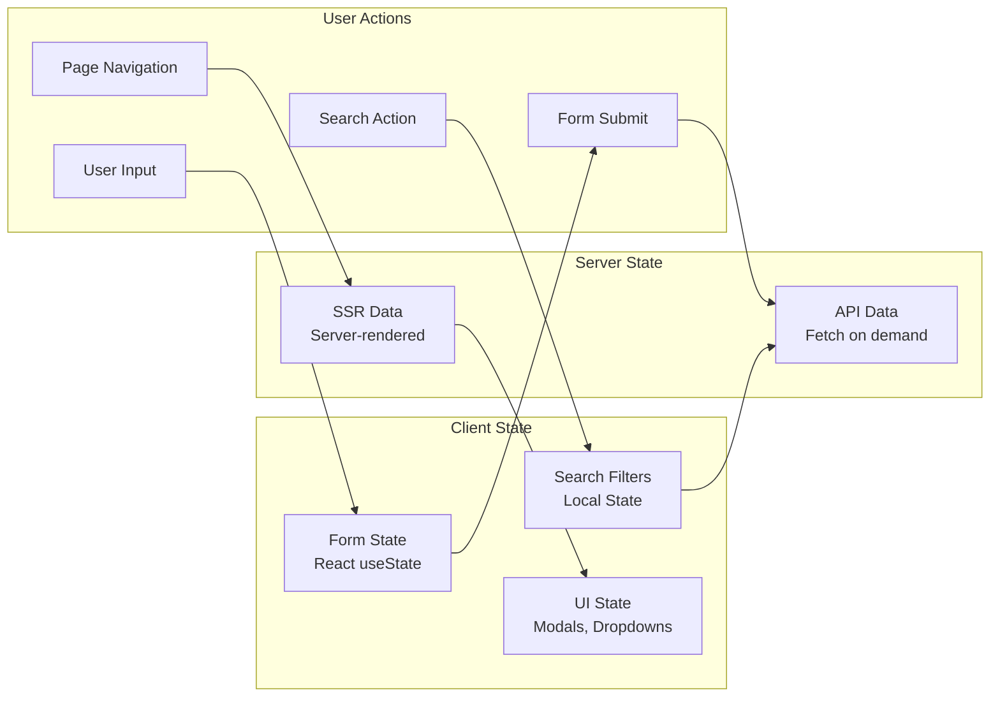
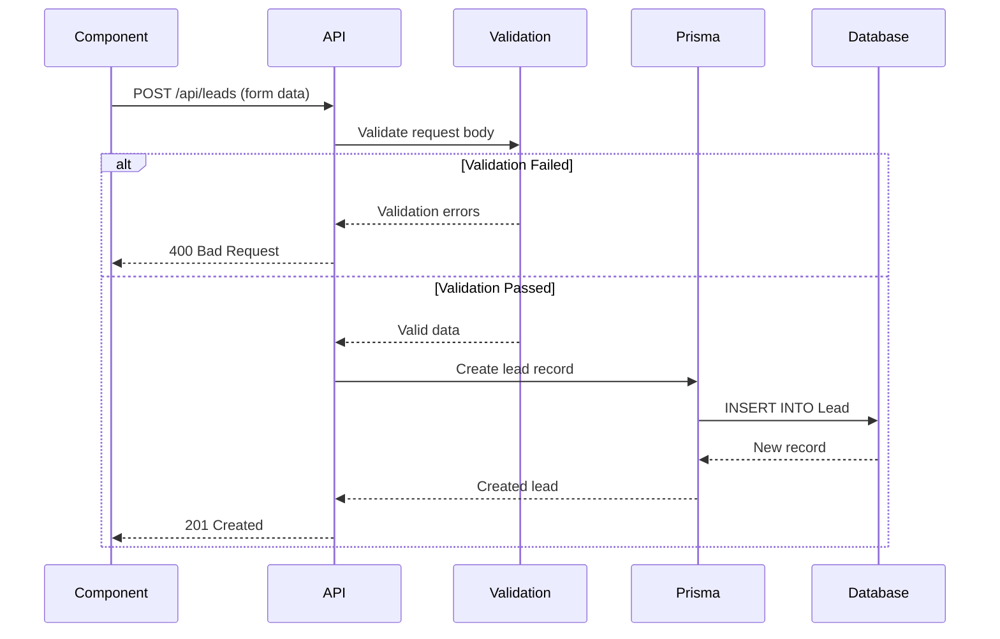
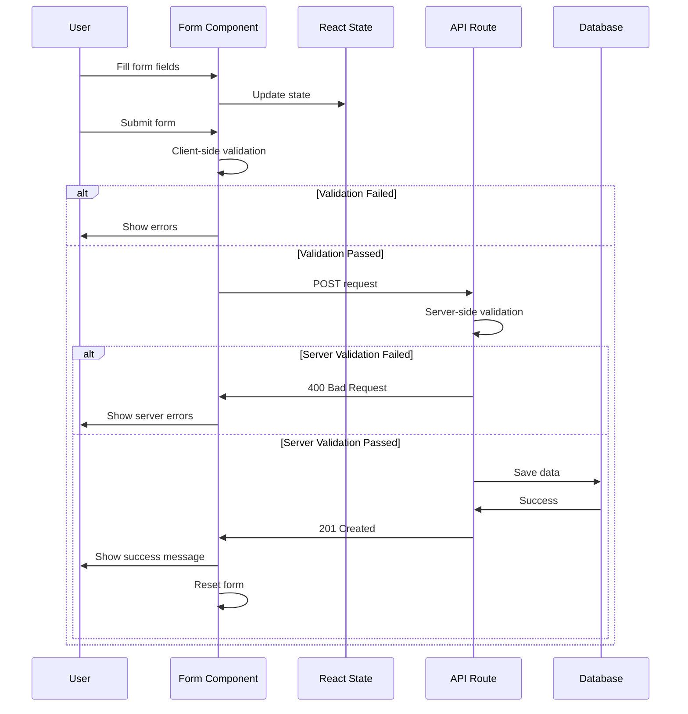

# Component Architecture

## Frontend Component Hierarchy

```mermaid
graph TB
    subgraph "Root Layout"
        RootLayout[app/layout.tsx<br>Root Layout]
    end

    subgraph "Page Components"
        HomePage[app/page.tsx<br>Home Page]
        BuyPage[app/buy/page.tsx<br>Buy Page]
        RentPage[app/rent/page.tsx<br>Rent Page]
        ProjectsListPage[app/projects/page.tsx<br>Projects List]
        ProjectDetailPage[app/projects/slug/page.tsx<br>Project Detail]
        LoginPage[app/login/page.tsx<br>Login Page]
        RegisterPage[app/register/page.tsx<br>Register Page]
        ContactPage[app/contact-us/page.tsx<br>Contact Page]
        EnqueryPage[app/enquery/page.tsx<br>Enquiry Page]
        PostingPage[app/posting/page.tsx<br>Posting Page]
    end

    subgraph "Shared Components"
        Header[components/Header.tsx<br>Navigation Header]
        Footer[components/Footer.tsx<br>Site Footer]
        WhatsAppChat[components/WhatsAppChat.tsx<br>WhatsApp Widget]
    end

    subgraph "Feature Components"
        HomePageComp[components/HomePage.tsx<br>Home Content]
        BuyPageComp[components/BuyPage.tsx<br>Buy Content]
        RentPageComp[components/RentPage.tsx<br>Rent Content]
        LoginComp[components/Login.tsx<br>Login Form]
        RegisterComp[components/Register.tsx<br>Register Form]
        ContactForm[components/Contact-form.tsx<br>Contact Form]
        EnqueryComp[components/Enquery.tsx<br>Enquiry Form]
        PostingComp[components/Posting.tsx<br>Property Posting]
    end

    subgraph "UI Components"
        SearchBar[components/SearchBar.tsx<br>Property Search]
        AdvancedSearchBar[components/AdvancedSearchBar.tsx<br>Advanced Search]
        RentSearchBar[components/RentSearchBar.tsx<br>Rent Search]
        PropertyCard[components/PropertyCard.tsx<br>Property Card]
        DetailedPropertyCard[components/DetailedPropertyCard.tsx<br>Detailed Card]
        RentalPropertyCard[components/RentalPropertyCard.tsx<br>Rental Card]
        PropertyListings[components/PropertyListings.tsx<br>Property Grid]
        HeroSection[components/HeroSection.tsx<br>Hero Banner]
    end

    RootLayout --> HomePage
    RootLayout --> BuyPage
    RootLayout --> RentPage
    RootLayout --> ProjectsListPage
    RootLayout --> ProjectDetailPage
    RootLayout --> LoginPage
    RootLayout --> RegisterPage
    RootLayout --> ContactPage
    RootLayout --> EnqueryPage
    RootLayout --> PostingPage

    HomePage --> Header
    HomePage --> Footer
    HomePage --> WhatsAppChat
    HomePage --> HomePageComp

    BuyPage --> Header
    BuyPage --> Footer
    BuyPage --> WhatsAppChat
    BuyPage --> BuyPageComp

    RentPage --> Header
    RentPage --> Footer
    RentPage --> WhatsAppChat
    RentPage --> RentPageComp

    LoginPage --> Header
    LoginPage --> Footer
    LoginPage --> WhatsAppChat
    LoginPage --> LoginComp

    RegisterPage --> Header
    RegisterPage --> Footer
    RegisterPage --> WhatsAppChat
    RegisterPage --> RegisterComp

    ContactPage --> Header
    ContactPage --> Footer
    ContactPage --> WhatsAppChat
    ContactPage --> ContactForm

    EnqueryPage --> Header
    EnqueryPage --> Footer
    EnqueryPage --> WhatsAppChat
    EnqueryPage --> EnqueryComp

    PostingPage --> Header
    PostingPage --> Footer
    PostingPage --> WhatsAppChat
    PostingPage --> PostingComp

    HomePageComp --> SearchBar
    HomePageComp --> PropertyListings
    HomePageComp --> HeroSection

    BuyPageComp --> AdvancedSearchBar
    BuyPageComp --> DetailedPropertyCard

    RentPageComp --> RentSearchBar
    RentPageComp --> RentalPropertyCard

    PropertyListings --> PropertyCard

    classDef page fill:#61dafb,stroke:#333,stroke-width:2px
    classDef shared fill:#68a063,stroke:#333,stroke-width:2px,color:#fff
    classDef feature fill:#f39c12,stroke:#333,stroke-width:2px
    classDef ui fill:#9b59b6,stroke:#333,stroke-width:2px,color:#fff

    class HomePage,BuyPage,RentPage,ProjectsListPage,ProjectDetailPage,LoginPage,RegisterPage,ContactPage,EnqueryPage,PostingPage page
    class Header,Footer,WhatsAppChat shared
    class HomePageComp,BuyPageComp,RentPageComp,LoginComp,RegisterComp,ContactForm,EnqueryComp,PostingComp feature
    class SearchBar,AdvancedSearchBar,RentSearchBar,PropertyCard,DetailedPropertyCard,RentalPropertyCard,PropertyListings,HeroSection ui
```



## State Management Flow



## API Integration Pattern



## File Structure

```
web-app/
├── app/                          # Next.js App Router
│   ├── api/                      # API Routes
│   │   ├── users/               # User CRUD endpoints
│   │   ├── properties/          # Property CRUD endpoints
│   │   ├── projects/            # Project CRUD endpoints
│   │   ├── leads/               # Lead CRUD endpoints
│   │   └── strapi-media/        # Media proxy
│   ├── buy/                     # Buy page
│   ├── rent/                    # Rent page
│   ├── projects/                # Projects pages
│   │   └── [slug]/             # Dynamic project detail
│   ├── login/                   # Login page
│   ├── register/                # Register page
│   ├── contact-us/              # Contact page
│   ├── enquery/                 # Enquiry page
│   ├── posting/                 # Property posting page
│   ├── layout.tsx               # Root layout
│   ├── page.tsx                 # Home page
│   └── globals.css              # Global styles
│
├── components/                   # React Components
│   ├── Header.tsx               # Site header
│   ├── Footer.tsx               # Site footer
│   ├── HomePage.tsx             # Home page content
│   ├── BuyPage.tsx              # Buy page content
│   ├── RentPage.tsx             # Rent page content
│   ├── SearchBar.tsx            # Search component
│   ├── PropertyCard.tsx         # Property card
│   ├── Login.tsx                # Login form
│   ├── Register.tsx             # Register form
│   ├── Contact-form.tsx         # Contact form
│   ├── Enquery.tsx              # Enquiry form
│   ├── Posting.tsx              # Property posting form
│   ├── WhatsAppChat.tsx         # WhatsApp widget
│   └── ui/                      # UI components
│
├── lib/                          # Shared Libraries
│   ├── prisma.ts                # Prisma client
│   ├── strapi.ts                # Strapi client
│   ├── types/                   # TypeScript types
│   │   ├── user.ts
│   │   ├── property.ts
│   │   ├── project.ts
│   │   └── lead.ts
│   ├── utils/                   # Utility functions
│   │   ├── error-handler.ts
│   │   ├── user.ts
│   │   ├── property.ts
│   │   ├── project.ts
│   │   └── lead.ts
│   ├── validation/              # Validation logic
│   │   ├── user.ts
│   │   ├── property.ts
│   │   ├── project.ts
│   │   └── lead.ts
│   └── generated/               # Generated code
│       └── prisma/              # Prisma client
│
├── prisma/                       # Prisma ORM
│   └── schema.prisma            # Database schema
│
├── public/                       # Static assets
│   ├── banner.jpg
│   ├── logo.png
│   └── ...
│
├── docs/                         # Documentation
│   ├── architecture.md          # This file
│   ├── component-architecture.md
│   ├── USER_API.md
│   └── LEAD_API.md
│
├── tests/                        # Test files
│   ├── user-api.test.ts
│   └── lead-api.test.ts
│
├── examples/                     # Example code
│   ├── user-api-client.ts
│   └── lead-api-client.ts
│
├── next.config.ts               # Next.js config
├── tsconfig.json                # TypeScript config
├── tailwind.config.ts           # Tailwind config
├── package.json                 # Dependencies
└── .env                         # Environment variables
```

## Component Responsibilities

### Page Components
- **Route handling**: Define application routes
- **Layout composition**: Combine shared and feature components
- **Data fetching**: Server-side data loading (SSR)
- **SEO metadata**: Page titles, descriptions

### Shared Components
- **Header**: Navigation, branding, user menu
- **Footer**: Links, copyright, social media
- **WhatsAppChat**: Floating chat widget

### Feature Components
- **HomePage**: Home page content and layout
- **BuyPage**: Property buying interface
- **RentPage**: Property rental interface
- **Login/Register**: Authentication forms
- **Contact/Enquiry**: Lead generation forms
- **Posting**: Property listing creation

### UI Components
- **SearchBar**: Property search with filters
- **PropertyCard**: Property display card
- **PropertyListings**: Grid of properties
- **HeroSection**: Banner/hero content

## Styling Architecture

```mermaid
graph TB
    subgraph "Styling System"
        TailwindCSS[Tailwind CSS<br>Utility-first]
        GlobalCSS[globals.css<br>Global styles]
        ModuleCSS[*.module.css<br>Component styles]
        GeistFonts[Geist Fonts<br>Typography]
    end

    subgraph "Components"
        Components[React Components]
    end

    TailwindCSS --> Components
    GlobalCSS --> Components
    ModuleCSS --> Components
    GeistFonts --> Components
```

## Routing Strategy

```mermaid
graph TB
    subgraph "Static Routes"
        Home[/ - Home]
        Buy[/buy - Buy Properties]
        Rent[/rent - Rent Properties]
        Projects[/projects - Projects List]
        Login[/login - Login]
        Register[/register - Register]
        Contact[/contact-us - Contact]
        Enquery[/enquery - Enquiry]
        Posting[/posting - Post Property]
    end

    subgraph "Dynamic Routes"
        ProjectDetail[/projects/slug - Project Detail]
    end

    subgraph "API Routes"
        UsersAPI[/api/users/*]
        PropertiesAPI[/api/properties/*]
        ProjectsAPI[/api/projects/*]
        LeadsAPI[/api/leads/*]
        MediaAPI[/api/strapi-media/*]
    end

    classDef static fill:#61dafb,stroke:#333,stroke-width:2px
    classDef dynamic fill:#f39c12,stroke:#333,stroke-width:2px
    classDef api fill:#68a063,stroke:#333,stroke-width:2px,color:#fff

    class Home,Buy,Rent,Projects,Login,Register,Contact,Enquery,Posting static
    class ProjectDetail dynamic
    class UsersAPI,PropertiesAPI,ProjectsAPI,LeadsAPI,MediaAPI api
```

## Form Handling Pattern



## Key Design Patterns

### 1. **Server Components (Default)**
- All components are Server Components by default
- Client Components marked with `"use client"`
- Reduces JavaScript bundle size

### 2. **API Route Handlers**
- RESTful API design
- Consistent response format
- Centralized error handling

### 3. **Type Safety**
- TypeScript throughout
- Prisma-generated types
- Custom type definitions

### 4. **Validation Layer**
- Request validation before database operations
- Consistent validation logic
- Detailed error messages

### 5. **Utility Functions**
- Reusable formatting functions
- Error handling utilities
- Response builders

