# Strapi CMS Integration Architecture

## Overview
This document details how the Next.js application integrates with Strapi v5 CMS for managing project media (images, brochures, etc.).

## Integration Architecture

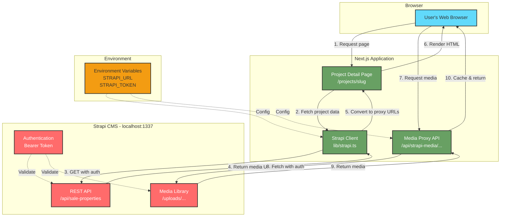

## Data Flow Sequence

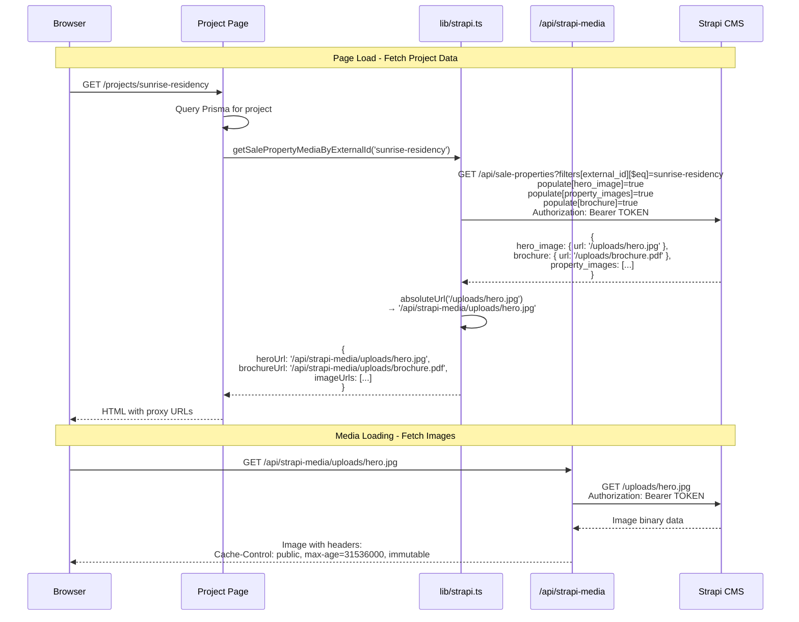

## Strapi Client Implementation

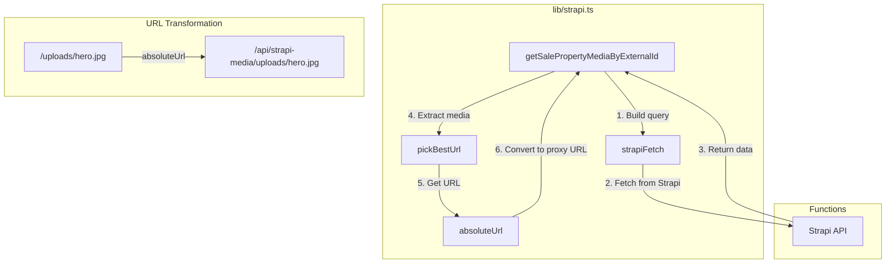

## Media Proxy Implementation

```mermaid
graph TB
    subgraph "app/api/strapi-media/[...path]/route.ts"
        Request[Incoming Request<br>/api/strapi-media/uploads/hero.jpg]
        ExtractPath[Extract path array<br>['uploads', 'hero.jpg']]
        BuildURL[Build Strapi URL<br>http://localhost:1337/uploads/hero.jpg]
        AddAuth[Add Authorization header<br>Bearer TOKEN]
        FetchMedia[Fetch from Strapi]
        ReturnMedia[Return with cache headers]
    end

    Request --> ExtractPath
    ExtractPath --> BuildURL
    BuildURL --> AddAuth
    AddAuth --> FetchMedia
    FetchMedia --> ReturnMedia

    subgraph "Error Handling"
        CheckEnv[Check STRAPI_URL exists]
        CheckResponse[Check response.ok]
        HandleError[Return error response]
    end

    Request --> CheckEnv
    CheckEnv -->|Missing| HandleError
    FetchMedia --> CheckResponse
    CheckResponse -->|Failed| HandleError
```

## Strapi v5 Data Structure

```mermaid
graph TB
    subgraph "Strapi v5 Response Structure"
        Response[API Response]
        Data[data: Array]
        Entity[Entity Object]
        HeroImage[hero_image: Object]
        Brochure[brochure: Object]
        PropertyImages[property_images: Array]
    end

    Response --> Data
    Data --> Entity
    Entity --> HeroImage
    Entity --> Brochure
    Entity --> PropertyImages

    subgraph "Media Object Structure"
        MediaObj[Media Object]
        URL[url: string]
        Formats[formats: Object]
        Large[large: { url }]
        Medium[medium: { url }]
        Small[small: { url }]
        Thumbnail[thumbnail: { url }]
    end

    HeroImage --> MediaObj
    Brochure --> MediaObj
    MediaObj --> URL
    MediaObj --> Formats
    Formats --> Large
    Formats --> Medium
    Formats --> Small
    Formats --> Thumbnail

    Note1[Note: Strapi v5 returns media<br>directly on entity, not in<br>.data or .attributes wrapper]
```

## URL Conversion Strategy

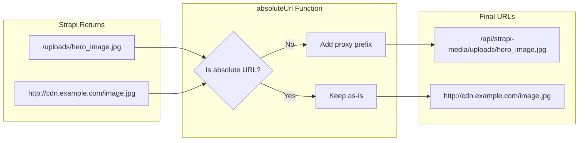

## Authentication Flow

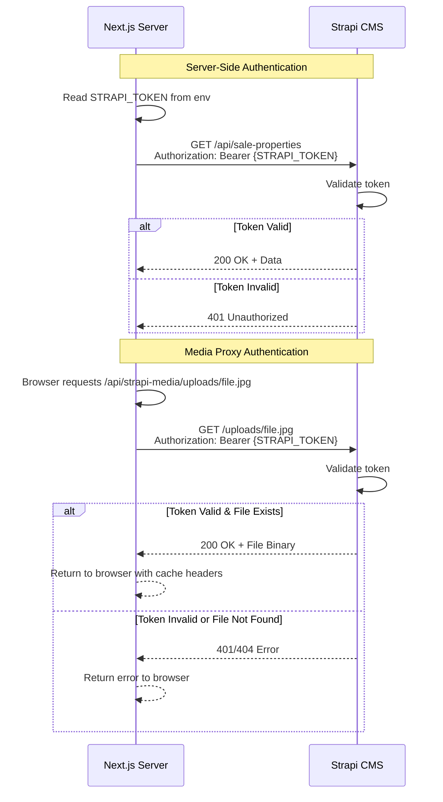

## Environment Configuration

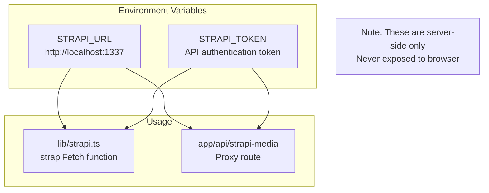

## Caching Strategy

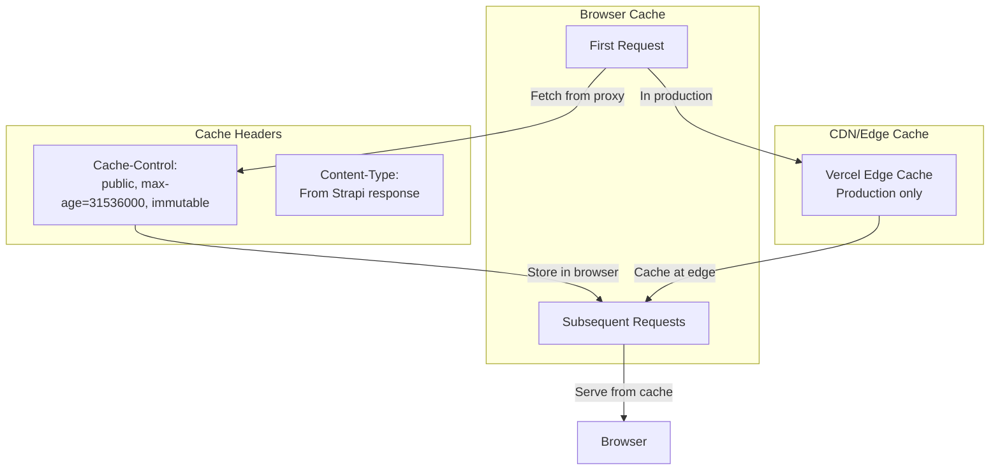

## Error Handling

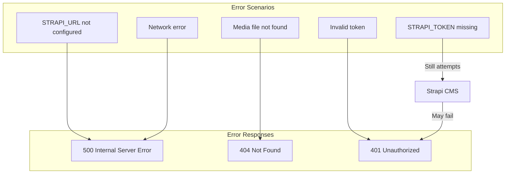

## Benefits of Proxy Pattern

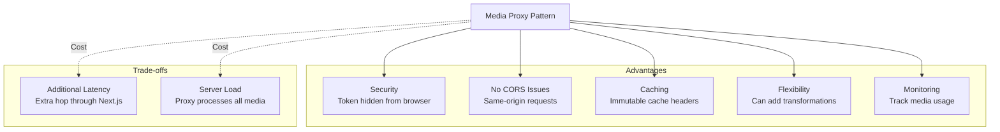

## Strapi Collection Structure

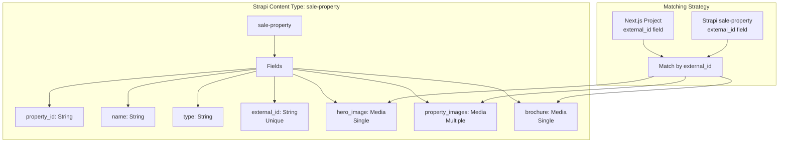

## Future Enhancements

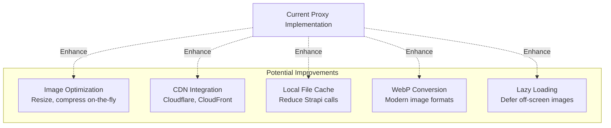

## Key Implementation Files

| File | Purpose |
|------|---------|
| `lib/strapi.ts` | Strapi client library with authentication |
| `app/api/strapi-media/[...path]/route.ts` | Media proxy API route |
| `app/projects/[slug]/page.tsx` | Project detail page consuming media |
| `.env` | Environment variables (STRAPI_URL, STRAPI_TOKEN) |

## Configuration Checklist

- [x] STRAPI_URL environment variable set
- [x] STRAPI_TOKEN environment variable set
- [x] Strapi CMS running on localhost:1337
- [x] sale-property collection created in Strapi
- [x] Media fields configured (hero_image, property_images, brochure)
- [x] Projects in database have matching external_id
- [x] Media files uploaded to Strapi
- [x] Proxy route handles authentication
- [x] URLs converted to proxy format
- [x] Cache headers configured

